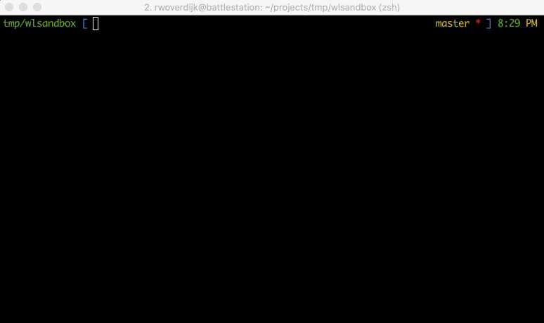

# Snapshots
> This step in the tutorial doesn't have any code.
>
> Find the full repository on github [here](https://github.com/SpoonX/wetland-tutorial).

This is a code-less tutorial part, where we look at what snapshots are and why they exist.

## Motivation
Managing migrations has always been a black or white situation.
You could either have dev migrations, and have the schema update automatically in development but find a solution for production deploys, or manage migrations yourself completely and write every change.
Both of these have upsides and downsides.

## Dev migrations
With dev migrations, you can develop your code faster.
You don't have to worry about your schema constantly and can just make progress.
This is awesome, but when pushing to production you have to figure out what you changed, and write some queries to update your schema in production.
That's difficult and unreliable, very prone to errors.

## Constant migrations
Using constant migrations, development becomes more complicated.
You have to constantly update your schema, or first write your migrations.
Even more annoying, writing migrations manually is just as prone to human error as writing queries.
On the positive side,  this gives you easier deploys as you already have managed migrations.

## Gray area
For wetland, we decided to try and find the gray area.
We want dev migrations to move forward quickly, but we also want migrations to document changes and have secure ways of managing updates and reverts.
A really cool bonus would be to have migrations auto generated, but that's too much to ask for... Or is it?

### Schema diffing
When trying to figure out how to update a schema, you would traditionally check with your database schema and perform a comparison.
This is a tedious task, especially if you switch database adapters a lot because you want to run benchmarks for example.
ORMs like waterline fetch all your data, perform some minor checks, re-create your schema and insert your data back in the table again. 
When this fails, you'll get a dump of the data it tried to insert.
Schema diffing is key to reliable dev migrations, so we decided to take a different approach.

### Enter snapshots
Snapshots are what allows wetland to provide the best of both worlds.
It supplies dev migrations, as well as actual migrations based on schema differences.
As a bonus, it generates these migrations for you, so all you have to do is check if wetland guessed right and add commit them into your favorite version control system.

## How it works
Snapshots capture the state of your mappings into a compressed file, which can then later be used for diffing with other snapshots, and restoring state.

In other words, you can tell wetland what your schema looked like before you started developing.
When you're done coding a new feature, or fixing a bug, you ask wetland to generate your migrations for you.
It then compares your current (dev-migrations updated) schema against the snapshot and creates a migration containing the `.up()` and `.down()` methods for you.

### Using snapshots
Creating a snapshot is really simple.
First, make sure you have the CLI installed, and wetland configured to run with it ([example](https://github.com/SpoonX/swetland/blob/master/wetland.js)).

Snapshots get named based on the branch you're on by default (convention), as do migrations.
You can decide not to use this convention by passing in a name.

Here's what a typical development flow might look like:

1. Create a new branch to start your work. (`git checkout -b feat/contact`)
2. Create a new snapshot to tell wetland you're about to build awesome stuff. (`wetland snapshot create`)
3. Then actual build the awesome stuff. While doing that, your database will update (when running dev migrations).
4. Once done, create a migration file. (`wetland migrator create`)
5. Repeat.

## Next step
We've briefly looked at what snapshots are, why they exist and how they can be applied.
Let's use them in the next steps of this tutorial.

[Go to the next part](dev-migrations.md).
